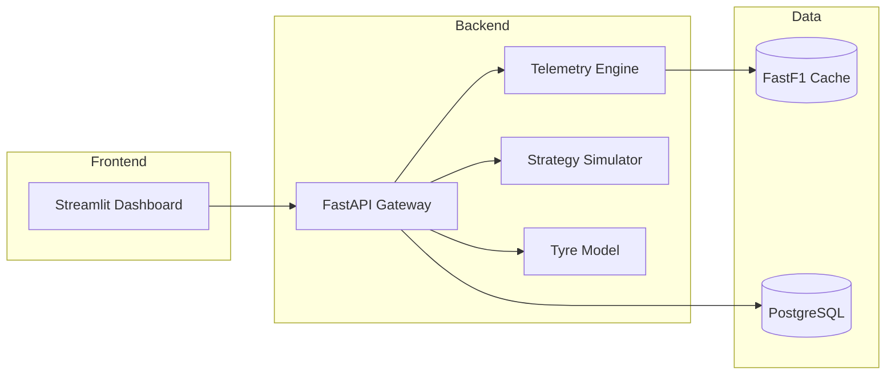

# F1 Performance Analytics

Formula 1 performance analytics dashboard for exploring race results, driver performance, and season trends.

## Overview

This project provides a simple starting point for analyzing F1 data and presenting key insights through a dashboard-style interface. It is intended to support comparisons across drivers, constructors, and races.

# F1 Performance Analytics

Formula 1 performance analytics workspace for telemetry comparison, spatial track analysis, strategy simulation, and model-backed stint forecasting.

## Overview

The dashboard uses FastF1 when available, falls back to deterministic synthetic telemetry when offline, and exposes the same analytics through a FastAPI gateway. The current UI emphasizes synchronized telemetry inspection, derived physics metrics, vector track overlays, live WebSocket telemetry, and 2026 regulation-aware derived channels.

## Architecture



## Features

- Unified telemetry comparison with synchronized hover and team color mapping
- Downsampled Plotly rendering for higher-frequency telemetry traces
- Live WebSocket telemetry streaming with synthetic fallback packets
- 2026 hybrid-era telemetry metrics including MGU-K output, SoC, derating, and active aero state parsing
- Spatial track overlays with dominance shading and corner annotations
- Tyre degradation prediction and Monte Carlo pit strategy search
- REST and WebSocket analytics endpoints

## Environment Variables

- `F1_DATA_MODE`: `LIVE` or `OFFLINE`
- `FASTF1_CACHE_DIR`: cache directory for FastF1 downloads
- `DATABASE_URL`: PostgreSQL connection string for backend services

## Getting Started

1. Install the dependencies into the project virtual environment:

   ```powershell
   .\.venv\Scripts\python.exe -m pip install -r requirements.txt
   ```

2. Start the dashboard with the launcher script:

   ```powershell
   .\run-dashboard.ps1
   ```

3. Or launch Streamlit directly:

   ```powershell
   streamlit run frontend/dashboard.py
   ```

4. Start the full stack with Docker:

   ```powershell
   docker compose up --build
   ```

## Quick Commands

- Dashboard: `python -m streamlit run frontend/dashboard.py`
- API: `uvicorn backend.app.main:app --reload`
- Tests: `python -m pytest tests -q`

## API Surface

- `GET /health`
- `POST /api/v1/telemetry/comparison`
- `POST /api/v1/strategy/optimize`
- `POST /api/v1/models/train`
- `WS /ws/telemetry`

### Telemetry Stream Schema

`TelemetryStreamPacket`

- `timestamp`: UTC timestamp for the sampled packet
- `session_name`: session label returned by the backend
- `regulation_context`: regulation tag for the packet stream, currently `2026-Hybrid`
- `driver_one` and `driver_two`: derived telemetry frames containing distance, speed, throttle, brake, gear, RPM, spatial coordinates, g-forces, MGU-K output, battery SoC, derating state, active aero mode, boost/overtake mode, and deployed electric energy

### Strategy Response Shape

`/api/v1/strategy/optimize` returns the legacy `best_strategy` and `optimal_strategy` keys, and the Monte Carlo engine also computes confidence intervals and pit-window overlap data internally for the dashboard overlay.

## Project Structure

- `backend/` - FastAPI gateway and request schemas
- `frontend/` - Streamlit dashboard
- `telemetry/` - ingestion, math, and spatial analysis
- `models/` - tyre degradation inference
- `database/` - schema and seed SQL
- `tests/` - unit and API tests

## Usage

Use the sidebar controls to switch drivers, select sessions, and tune strategy assumptions. Set `F1_DATA_MODE=OFFLINE` for deterministic demo data or `LIVE` to request FastF1-backed telemetry.

The live canvas first tries `ws://localhost:8000/ws/telemetry` and falls back to synthetic packets if the backend stream is unavailable.

## Contributing

Keep changes focused, update tests when touching analytics logic, and document new payloads or endpoints in this file.

